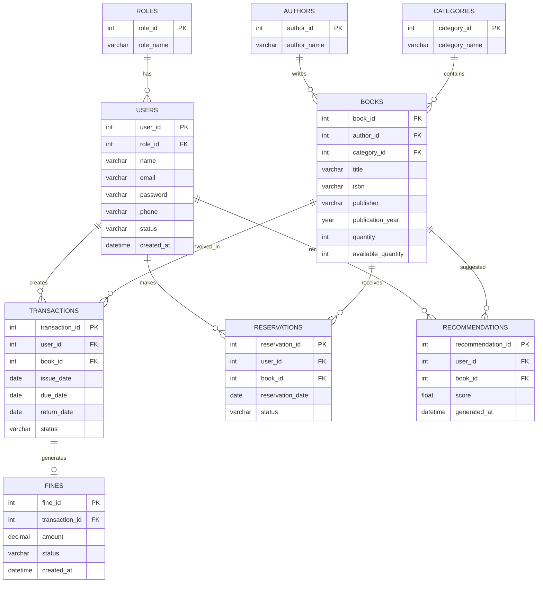

# Entity Relationship Diagram (ER Diagram)

## Smart Library System with AI Recommendations

---

# 1. Introduction

The Entity Relationship Diagram represents the database structure of the Smart Library System.

It shows entities, attributes, primary keys, foreign keys, and relationships between different database components.

---

# 2. ER Diagram

The following ER diagram uses Mermaid notation.



---

# 3. Relationship Explanation

## Roles and Users

**Relationship: One-to-Many**

* One role can belong to many users.
* Each user has one assigned role.

Example:

```text
Administrator Role → Multiple Administrators
Student Role → Multiple Students
```

---

## Users and Transactions

**Relationship: One-to-Many**

* One student can have multiple borrowing transactions.
* Each transaction belongs to one user.

---

## Books and Transactions

**Relationship: One-to-Many**

* One book can appear in multiple transaction records.
* Each transaction references one book.

---

## Users and Reservations

**Relationship: One-to-Many**

* One student can create multiple reservations.
* Each reservation belongs to one student.

---

## Transactions and Fines

**Relationship: One-to-One**

* One transaction can generate one fine record.
* Fine is created only when overdue conditions occur.

---

## Users and Recommendations

**Relationship: One-to-Many**

* One student can receive multiple recommendations.
* Each recommendation belongs to one student.

---

## Books and Recommendations

**Relationship: One-to-Many**

* One book can be recommended to multiple users.

---

# 4. Database Design Summary

The ER model provides:

* Data consistency
* Proper relationship management
* Reduced duplication
* Easy database maintenance
* Support for AI recommendation processing

---

The ER Diagram acts as the blueprint for implementing the MySQL database.
